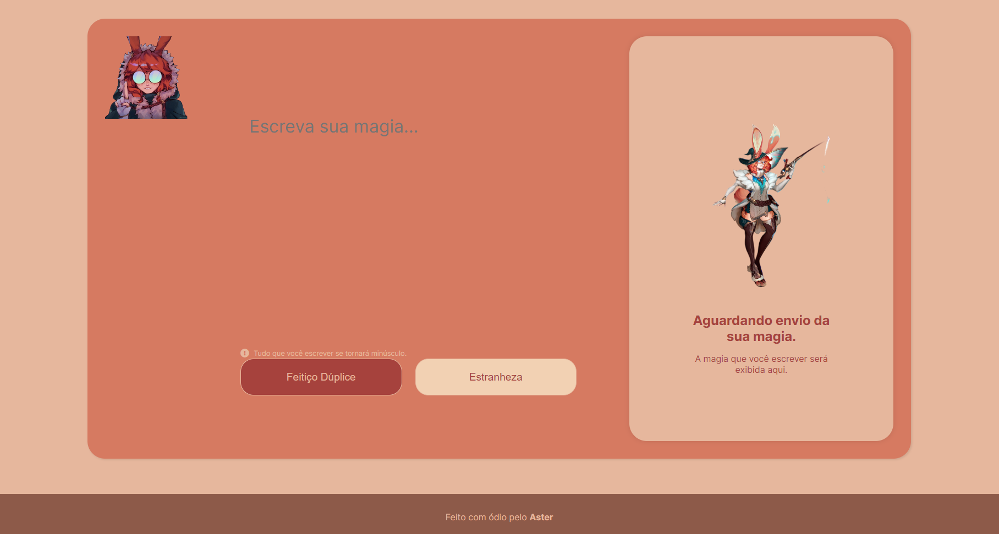

<h1 align="center"> Transformador Mágico </h1>

Este é um projeto de decodificação de texto feito para o curso da Oracle One.

## 🐱‍👓 Imagem Ilustrativa do Projeto

  

## 🐱‍💻 Descrição

O objetivo deste projeto é criar um decodificador de texto que possa converter mensagens em um texto codificado e também  descriptografar esse texto, além de copiar o resultado da decodificação/codificação.
Esse projeto foi feito basdeado na personagem Aurora do League of Legends, os botões de criptografar e descriptografar são habiilidades da personagem.

## 🤖 Funcionalidades

- Decodificação de mensagens criptografadas
- Criptografar mensagens
- Interface amigável para facilitar a utilização

## 💻 Tecnologias

- HTML e CSS
- JavaScript
- Git e Github